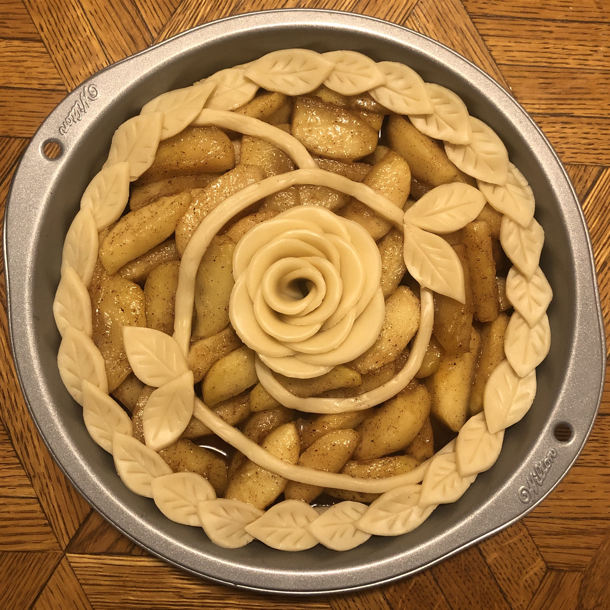
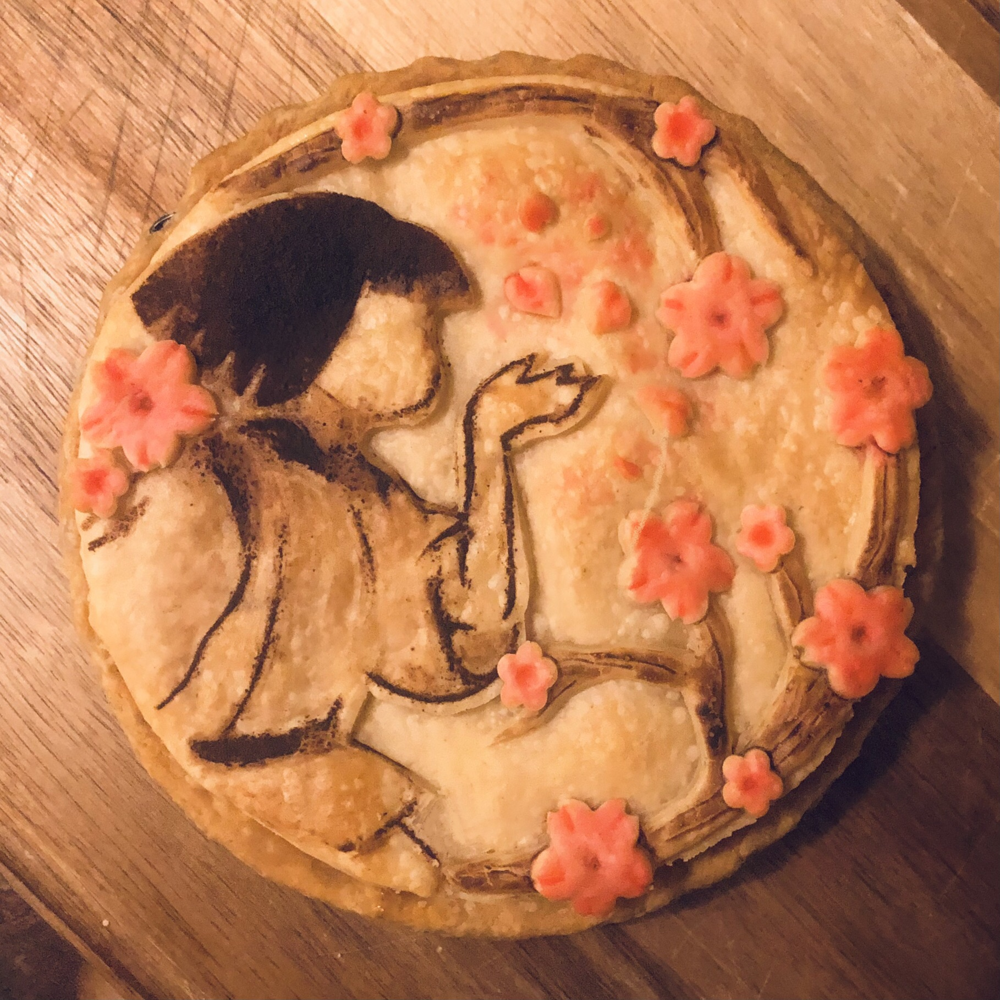
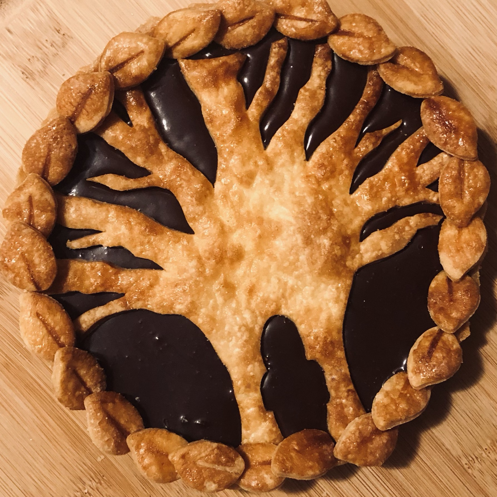
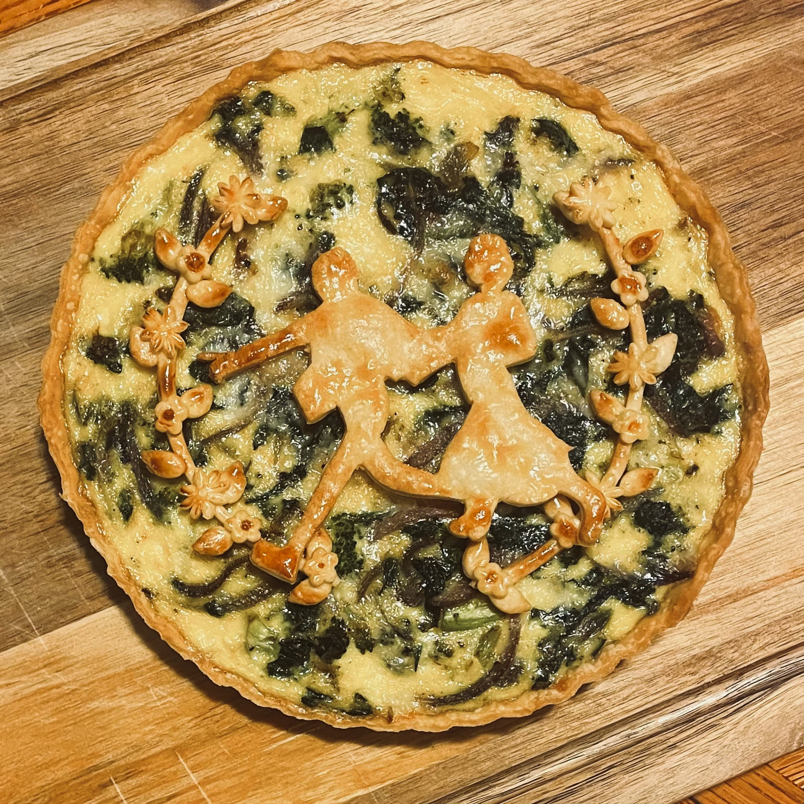
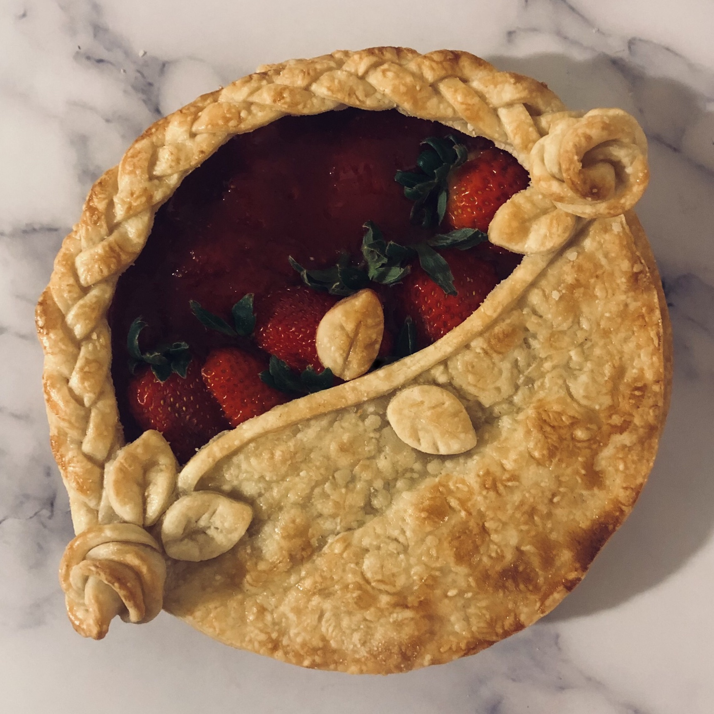

---
title:
output:  
  html_document:  
    self_contained: no  
    theme: flatly
    toc: false
    classoption:
    - threecolumn
---

```{r, echo=FALSE}
aniview::use_aniview() # animate presence of content
```

```{css, echo=FALSE}
/* for responsive image sizing */
.responsive {
  width: 100%;
  height: auto;
}
```

<!-- for accessing the link icons --> 
<script src="https://kit.fontawesome.com/455169677b.js" crossorigin="anonymous"></script> 

<br>

::: {.aniview data-av-animation="fadeInUp"}

<!-- <center><h3><font color="#8c7edc"> Still baking! Thanks for your patience 🙇🏻‍♀️ </font></h3></center> -->

<!-- According to the <a target="_blank" rel="noopener noreferrer" href="https://www.theserialhobbyistgirl.com/about-me/">Serial Hobbyist Girl</a>, -->

<!-- > "A serial hobbyist is someone who spends their life, or a large portion of it, moving from hobby to hobby, trying many things but not really sticking with any for the long haul." -->

<h3><b>This page showcases some of my pie art 🥧👩🏻‍🎨, my top 9.</b></h3>


Every 1-2 years, I devote my free time to a *set* of new crafts and activities. Some of these hobbies have become regular, long-term engagements. Others are dropped, giving me more time to focus on existing activities or start new ones. In recent years, my hobbies have included pie art, video editing, drawing, reading comics, volleyball, video games, strength training, chess, etc. **Decorating pies has been one activity that I have stuck with for years.**


Some notes:

- Each pie art piece takes several days to plan and execute. Lots of crust design drafting and experimentation occurred (e.g., baking painted crust). This is my favorite part of the process!
- Many times, the final look of the pie is completely different than planned because I often make mistakes during the execution (e.g., I over-bake the crust). I view these situations as new challenges that make the activity even more exciting and fun. How can I best recover from this? What can I learn from this mishap?
- I often make the same few flavors of pie filling - apple, chocolate, or strawberry. 
- The inspiration for these pieces mostly comes from media I am consuming at the moment.
- I also enjoy baking and decorating other sweets, such as tarts and cheesecakes 🍰


Feel free to <a target="_blank" rel="noopener noreferrer" href="mailto:shirleyduong5@gmail.com">email me</a> about these works and thanks for looking!


:::::::::::::: {.columns}


::: {.column width="33%"}



:::


::: {.column width="33%"}



:::


::: {.column width="33%"}



:::


::::::::::::::


:::
