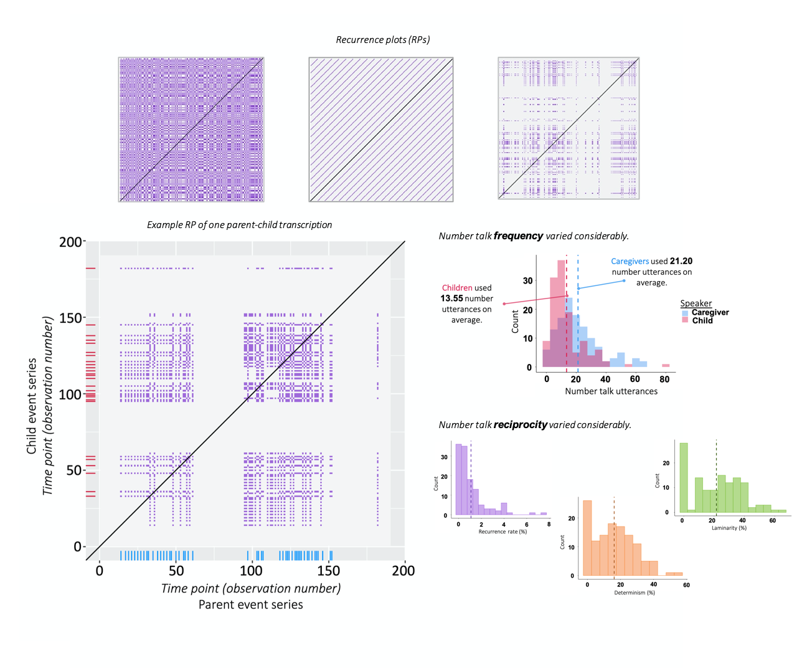
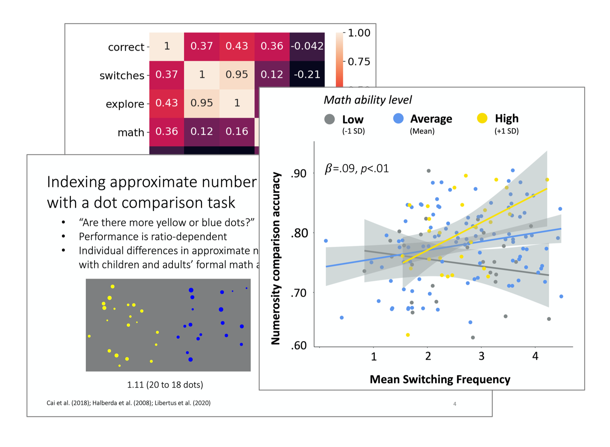
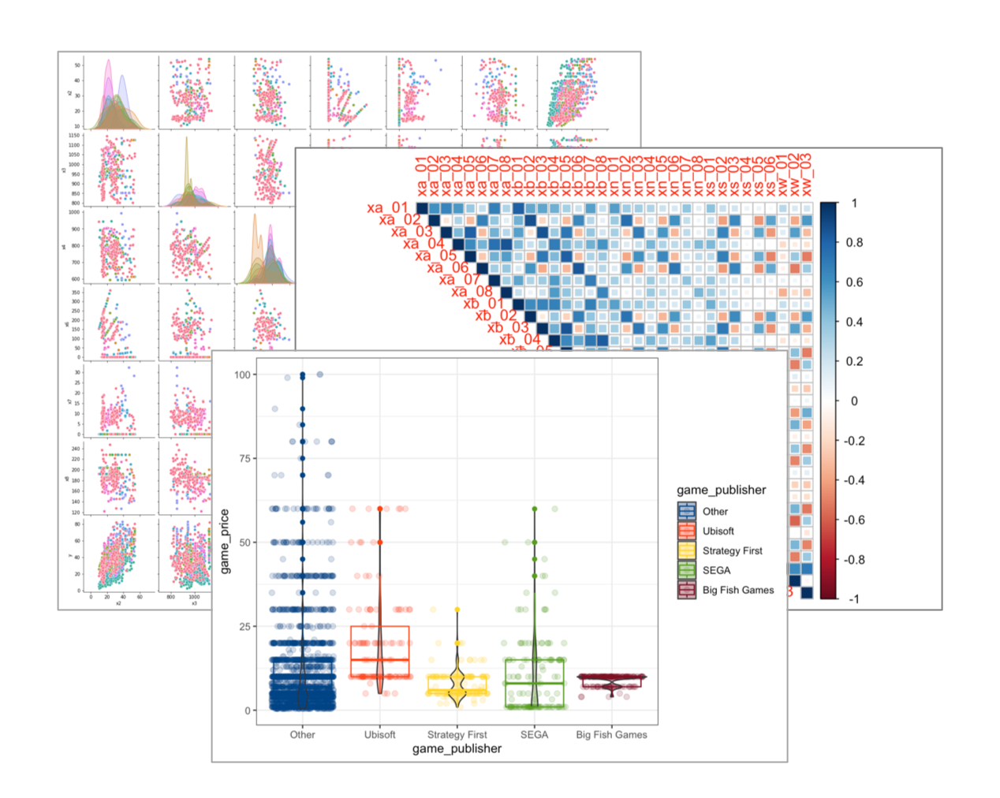

```{r, echo=FALSE}
aniview::use_aniview() # animate presence of content
```

```{css, echo=FALSE}
/* for responsive image sizing */
.responsive {
  width: 100%;
  height: auto;
}
```

<!-- for accessing the link icons --> 
<script src="https://kit.fontawesome.com/455169677b.js" crossorigin="anonymous"></script> 


::: {.aniview data-av-animation="fadeInUp"}


> The gist: A versatile data **analyst**, **visualizer**, and **storyteller**.


* [Dynamic structures of social interactions](#dynamic-structures-of-social-interactions)
* [Profiles of home learning environments](#profiles-of-home-learning-environments)
* [Hot dasher summer](#hot-dasher-summer)
* [Exploration, uncertainty, and numerical judgements](#exploration-uncertainty-and-numerical-judgements)
* [EDA city over here](#eda-city-over-here)
* [High cognitive demand questions](#high-cognitive-demand-questions)


<!-- <br> -->


<!-- <center> -->
<!-- Leading these projects have given me opportunities to engage deeply in: -->

<!-- <h5>👩🏻‍🎨 **Experimental design**  |  ✍🏼 **Data collection**  |  🧹 **Data cleaning, 👩🏻‍💻 pre-processing, and 🎨🖌 blending**  |  🧭 **Exploratory data analysis**  |  📊 **Visualization**  |  📉 **Machine learning**  |  🗣📝 **Scientific communication**  |  🤝 **Research collaboration**  </h5> -->
<!-- </center> -->

<!-- <br> -->

<!-- <center>...</center> -->
<!-- <br> -->

View a full list of my projects on the <a href=publications.html>Scientific Communications</a> page and/or <a target="_blank" rel="noopener noreferrer" href="mailto:shirleyduong5@gmail.com">ask me</a> about my work as <font color="#8c7edc">**Data Analyst**</font>!


---

:::::::::::::: {.columns}
::: {.column width="40%"}



<span class="badge bg-primary">R</span> <span class="badge bg-success">event/time series analysis</span> <span class="badge bg-success">recurrence analysis</span> <span class="badge bg-success">inter-rater reliability</span> <span class="badge bg-success">descriptive analysis</span> <span class="badge bg-success">transcription coding</span> <span class="badge bg-primary">ggplot2</span> <span class="badge bg-secondary">Qualtrics</span> <span class="badge bg-secondary">Datavyu</span> 

:::


::: {.column width="5%"}
:::

::: {.column width="55%"}

# Dynamic structures of social interactions

A visual and quantitative analysis of **dyadic interactions** between caregivers and children using **cross-recurrence quantification analysis (CRQA)**. Specifically, this project extracts additional measures of interactions beyond frequencies of input (e.g., words, utterances), such as the presence and duration of **reciprocal** exchanges. This work is a <font color="#8c7edc"><b>collaboration</b></font> with <a target="_blank" rel="noopener noreferrer" href="https://researchdirectory.uc.edu/p/davtj">Tehran Davis</a> at the University of Cinncinati.  

[<a target="_blank" rel="noopener noreferrer" href="https://github.com/s-duong/crqa-number-talk">Analysis code + Tutorial</a>] [<a target="_blank" rel="noopener noreferrer" href="files/Duong_CogTalk_Nov22_CRQA_Slides.pdf">Slides for <i>Pitt Cognitive Talk Series</i></a>] [Journal article (under review)]

<!-- <details><summary>There are a few parts:</summary> -->

<!-- - Chronological **literature review** on the application of CRQA in early language research. -->
<!-- - **Case study** and **tutorial** of CRQA on existing transcription data of dyadic conversations about numbers and math. -->
<!-- - **Qualitative analysis** comparing frequency and CRQA measures of conversations and a **quantitative analysis** of the relations between input measures and children's academic skills.  -->
<!-- </details> -->


The **overarching goal** of this project was to find **computationally-inexpensive ways** to uncover additional insights in existing transcription data for the purposes of (1) **enhancing scientific knowledge** on language and learning, (2) **optimizing data reuse** within the <a href=https://lrdc.pitt.edu/ppel/>Parents Promoting Early Learning Study</a>, and (3) **sharing this method** with researchers.

:::

::::::::::::::


---


:::::::::::::: {.columns}
::: {.column width="55%"}

# Profiles of home learning environments

A **cluster analysis** of families' **early math** practices, including math-related conversations and activities. 

This is my <font color="#8c7edc">**dissertation**</font> project, in which I am **classifying families** based on various cognitive, affective, and socioeconomic factors and using these derived clusters to **predict children's academic skills**. 

This project <font color="#8c7edc">extends my previous work</font> (pictured in the boxplot), a **cluster analysis** of dyadic interactions using various **language input** measures. [<a target="_blank" rel="noopener noreferrer" href="files/Duong_CogTalk_Nov21_NumberClusters_Slides.pdf">Slides for <i>Pitt Cognitive Talk Series</i></a>] [<a target="_blank" rel="noopener noreferrer" href="files/DuongEtAl-2022_CDS.pdf">Poster for <i>Cognitive Development Society Meeting</i></a>]


:::

::: {.column width="5%"}
:::

::: {.column width="40%"}


<span class="badge bg-primary">R</span> <span class="badge bg-success"><i>k</i>-means cluster analysis</span> <span class="badge bg-success">hierarchical cluster analysis</span> <span class="badge bg-success">multinomial logistic regression</span> <span class="badge bg-success">inter-rater reliability</span> <span class="badge bg-success">descriptive analysis</span> <span class="badge bg-success">transcription coding</span> <span class="badge bg-primary">ggplot2</span> <span class="badge bg-secondary">Qualtrics</span> <span class="badge bg-secondary">Datavyu</span> 

:::
::::::::::::::


---


# Hot dasher summer

A <font color="#8c7edc">**personal**</font> project to **track**, **visualize**, and **analyze** data on my ongoing <font color="red">**DoorDash**</font> side gig.

<span class="badge bg-primary">R</span> <span class="badge bg-primary">SQL</span> 
<!-- <span class="badge bg-secondary">Tableau/Google Looker Studio/Shiny</span>  -->


---


:::::::::::::: {.columns}
::: {.column width="40%"}



<span class="badge bg-primary">R</span> <span class="badge bg-primary">ggplot2</span> <span class="badge bg-primary">Python</span> <span class="badge bg-primary">NumPy</span> <span class="badge bg-primary">pandas</span> <span class="badge bg-primary">SciPy</span> <span class="badge bg-primary">Seaborn</span> <span class="badge bg-primary">MATLAB</span> <span class="badge bg-success">mixed effects logistic regression</span> <span class="badge bg-success">exploration simulations</span>

:::


::: {.column width="5%"}
:::

::: {.column width="55%"}
# Exploration, uncertainty, and numerical judgements

An **eye-tracking** study of **exploratory behavior**, i.e., eye switching frequency, during **numerical comparisons** and math skills in:

- Children [<a target="_blank" rel="noopener noreferrer" href="https://github.com/s-duong/exploration-eyetracking-ans/blob/main/Final_Project_Duong.ipynb">Jupyter Notebook</a>]
- Adults [<a target="_blank" rel="noopener noreferrer" href="files/Duong_Fall2020_CMU_BrainBag.pdf">Slides for <i>CMU Brain Bag</i></a>] [<a target="_blank" rel="noopener noreferrer" href="files/DuongLibertus-2020_JDM.pdf">Poster for <i>Judgement and Decision Making Conference</i></a>]

:::

::::::::::::::


---


:::::::::::::: {.columns}
::: {.column width="55%"}

# EDA city over here

I have conducted exploratory data analysis in many courses. Below are 3 of my favorite recent EDA reports. I had the most fun working on them for various reasons (e.g., I got to choose a personally interesting dataset, I was learning something new and exciting). 

**I always write my reports in a (kind of) tutorial style as this helps me (and hopefully others) learn!**

- Text sentiment-derived features from sales representatives’ reports of customer interactions [<a target="_blank" rel="noopener noreferrer" href="files/Duong_Shirley_Final_01_Data_Exploration.html">HTML of R Markdown</a>]
- <a target="_blank" rel="noopener noreferrer" href="https://github.com/rfordatascience/tidytuesday/tree/master/data/2019/2019-07-30">Video games dataset</a> from TidyTuesday [<a target="_blank" rel="noopener noreferrer" href="files/Duong_Shirley_Midterm_df2.html">HTML of R Markdown</a>]
- Mysterious dataset provided by the instructor, a chance to use the **Seaborn** library (since I prefer ggplot2 🙂) [<a target="_blank" rel="noopener noreferrer" href="files/Duong_Shirley_Midterm_df1_python.html">HTML of Juypter Notebook</a>]

:::

::: {.column width="5%"}
:::

::: {.column width="40%"}



<span class="badge bg-primary">R</span> <span class="badge bg-primary">ggplot2</span> <span class="badge bg-primary">Python</span> <span class="badge bg-primary">Seaborn</span>

:::

::::::::::::::


---

# High cognitive demand questions

A multi-study project with 2 aims: 

- Explore **links** between children's exposure to caregivers' high (vs. low-) cognitive demand (CD) **questions** in the home learning environment and children's **early academic skills**. [<a target="_blank" rel="noopener noreferrer" href="">Analysis code</a>] [<a target="_blank" rel="noopener noreferrer" href="files/DuongEtAl-2021_JECP.pdf">Journal article in <i>Journal of Experimental Child Psychology</i></a>] 
- Investigate caregiver and child **factors** that **predict high-CD questioning**. [<a target="_blank" rel="noopener noreferrer" href="">Analysis code</a>] [Journal article (under review)]

<span class="badge bg-primary">R</span> <span class="badge bg-primary">Stata</span> <span class="badge bg-success">linear regression</span> <span class="badge bg-success">mixed effects logistic regression</span> <span class="badge bg-success">inter-rater reliability</span> <span class="badge bg-success">power analysis</span> <span class="badge bg-success">transcription coding</span> <span class="badge bg-secondary">Qualtrics</span> <span class="badge bg-secondary">Datavyu</span> 


<br>


::: 
